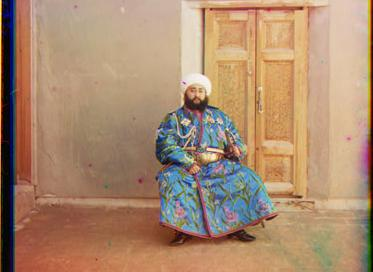
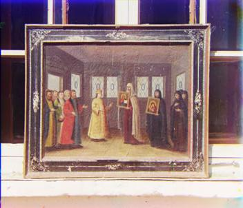
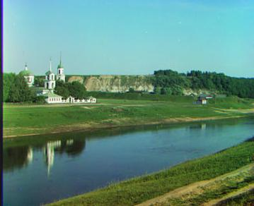
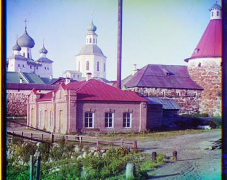
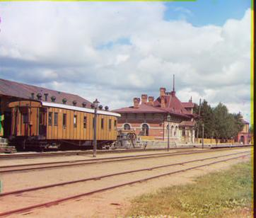
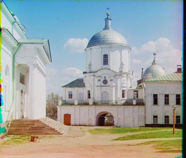

# Computer-Vision-ImageAlignment-prokudin-gorskii-Collections

IMAGE ALIGNMENT The images are taken vertically on glass plates with the order blue, green and red
from the top. To align the image, first it is cut into three sections, each representing a color channel. Then
the blue and red channels are aligned to the green channel.

Naive Algorithms The easiest way to figure out the x- and y-displacements is to compare the intensity of
B channel and G channel to R channel. We have to algorithms for comparison,

1. Sum of squared differences (SSD) :
 - Calculate the sum of the squared difference between the reference channel and the shifted channel.
- Find the corresponding x- and y-displacements that has the minimum SSD. The smaller the SSD, the more similar color intensities of the two channels are.

2. Normalized Cross-Correlation (NCC)
- Calculate the dot product of the normalized reference channel and the normalized shifted channel.
- Find the corresponding x- and y-displacements that has the maximum NCC. The bigger the NCC, the more similar color intensities of the two channels are.

In order to align the image, only the center-most 60 % of the image is used. In other words, 20 % around
each edge is cut out. This is to make sure that the borders do not affect the image alignment.

I tried both naive aligment methods: sum of squared differences (SSD) and normalized cross-correlation
(NCC). I chose to use SSD in my naive algorithm because I found that SSD performed better after cropping
the 20% of the image off of each edge of the images to eliminate interference from image border.
My default search was over a small window of possible shifts: -15 <= x <=15and -15<=y<=15, where x is the
number of rows to shift the image and y is the number of columns to shift the image.

Cropping Output Image To crop the unwanted corners of the output image and produce a clear result. I
tried following algorithm.

1. Extract thee top and left-most corner of the image to improve the performance of the program.
2. Convert Each layer into an edge image and calulate the mean value of each axis.
3. Mask the mean values against a threshold, which is 3 * the mean value of the mean value vector.
4. Find the last non-zero value of this mask, which gives us the x or y coordinate of the end of the border.
5. Repeat above for each layer, the highest value of the x or y coordinate gives the border that goes furthest into image.
6. Crop the image using calculated coordinates.

**Results**

